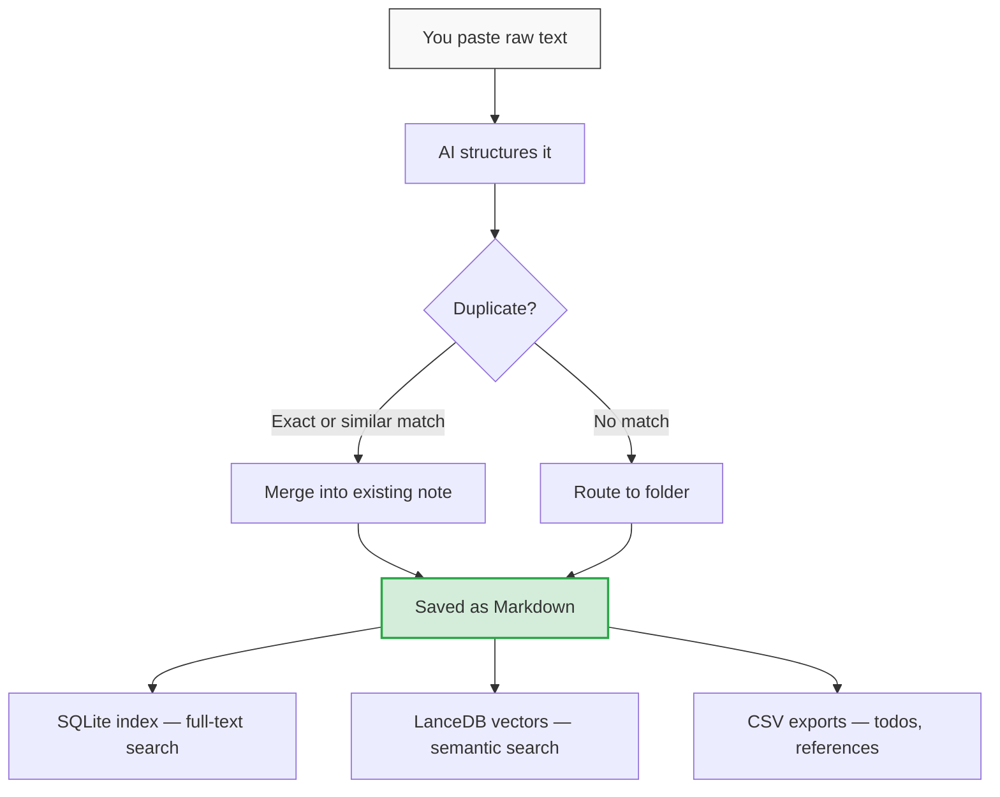

```
 ███╗   ██╗ ██████╗ ████████╗███████╗██╗  ██╗   ██╗
 ████╗  ██║██╔═══██╗╚══██╔══╝██╔════╝██║  ╚██╗ ██╔╝
 ██╔██╗ ██║██║   ██║   ██║   █████╗  ██║   ╚████╔╝
 ██║╚██╗██║██║   ██║   ██║   ██╔══╝  ██║    ╚██╔╝
 ██║ ╚████║╚██████╔╝   ██║   ███████╗███████╗██║
 ╚═╝  ╚═══╝ ╚═════╝    ╚═╝   ╚══════╝╚══════╝╚═╝
 The filing system AI agents can actually use.
```

[](LICENSE)
[](https://www.python.org/downloads/)
[](tests/)

Paste your meeting notes, Slack threads, or quick thoughts. AI organizes them into searchable markdown files. You never have to sort, tag, or file anything yourself.

```
You paste this:                          You get this:

  hey just got off the call with          notes/clients/acme/2026-03-05_acme-kickoff.md
  Jake from Acme. they want to            ---
  launch by Q3, need us to scope          title: Acme Kickoff Call
  the API integration first.              summary: Acme wants Q3 launch, API integration
  Jake will send the spec by                scoping needed first.
  Friday. budget is 50k.                  tags: [kickoff, api, acme]
                                          participants: [Jake]
                                          action_items:
                                            - task: Send API spec
                                              owner: Jake
                                              due: 2026-03-07
                                          ---
                                          Full structured notes here...
```

Notely handles the rest: duplicate detection (won't save the same paste twice), folder routing (figures out where it goes), action item extraction, and full-text + semantic search across everything.

## Quick Start

```bash
pip install notely

# Set up your Anthropic API key
echo "ANTHROPIC_API_KEY=sk-ant-..." > .env

# Interactive setup — creates your workspace
notely init

# Start capturing
notely open
```

That's it. `notely open` gives you an interactive session. Paste anything. The AI structures it and saves it as a clean markdown file.

## What It Looks Like

### Capturing notes

```
notely-notetaker> [paste your meeting notes, Slack thread, anything]

  Preview
  ──────────────────────────────────────
  Acme Kickoff Call
  Acme wants Q3 launch, API integration scoping needed first.
  tags: kickoff, api, acme
  participants: Jake

  Action items:
    [ ] Send API spec — Jake, due Fri
  ──────────────────────────────────────

  [Y]es, save / [e]dit first / [n]o, skip: y
  Saved: clients/acme/2026-03-05_acme-kickoff.md
```

### Managing todos

```
notely-notetaker> /todo

  ★ Today
  ─────────────────────────────────────
    1. Deploy v2 to staging              Chloe · due today
    2. Fix auth bug                      Chloe · due Fri

  Acme
  ─────────────────────────────────────
    3. Send API spec                     Jake · due Fri
    4. Review SOW                        Chloe · due Mon

  4 open — done · add · today · due · timer · q
```

### Searching

```bash
notely search "API integration"

  1. Acme Kickoff Call (2026-03-05) [clients/acme]
     Acme wants Q3 launch, API integration scoping needed first.

  2. Platform Architecture (2026-02-28) [projects/vault]
     REST API design decisions for the Vault project.
```

### Chatting with your notes

```
notely-notetaker> /chat acme

notely-chat (Acme)> what are the open items for Acme?

  Based on your notes, here are the open items:
  1. Jake needs to send the API spec (due Friday)
  2. SOW review is pending (due Monday)
  3. No timeline set for scoping yet
```

## How It Works



**Markdown files are the source of truth.** Everything else (search index, vectors, CSV exports) is derived and can be rebuilt with `notely reindex`. You can edit your notes by hand in any text editor — notely respects your changes.

### Data Architecture

```mermaid
flowchart LR
    subgraph Source of Truth
        MD["Markdown files\nnotes/**/*.md"]
    end
    subgraph Derived — rebuildable
        DB["SQLite + FTS5\nindex.db"]
        VEC["LanceDB\n.vectors/"]
        CSV["CSV exports\n_todos.csv"]
    end

    MD --> DB --> VEC
    DB --> CSV

    style MD fill:#d4edda,stroke:#28a745,stroke-width:2px
    style DB fill:#fff3cd,stroke:#ffc107
    style VEC fill:#fff3cd,stroke:#ffc107
    style CSV fill:#fff3cd,stroke:#ffc107
```

## Two Ways to Use It

### CLI (default)

Uses the Anthropic API to structure your notes. Requires an API key.

```bash
notely open          # Interactive session
notely dump < file   # One-shot: pipe text in, get structured note out
```

### MCP Server (Claude Desktop / Claude Max)

Claude becomes the AI — no API calls, no cost. Add to your Claude Desktop config:

```json
{
  "mcpServers": {
    "notely": {
      "command": "python",
      "args": ["-m", "notely.mcp_server"],
      "cwd": "/path/to/your/workspace"
    }
  }
}
```

Both paths produce the same markdown files and search index.

## Commands

| Command | What it does |
|---------|-------------|
| `notely open` | Interactive session — paste notes, drag files, slash commands |
| `notely dump` | One-shot: pipe text in, AI structures, save |
| `notely search <query>` | Full-text search across all notes |
| `notely todo` | View and manage action items |
| `notely list` | List recent notes |
| `notely show <id>` | Display a full note |
| `notely edit <id>` | Open in your editor, re-indexes on save |
| `notely init` | Set up a new workspace |
| `notely reindex` | Rebuild search index from markdown files |

### Inside `notely open`

| Command | What it does |
|---------|-------------|
| `/todo` | Interactive todo mode — mark done, add tasks, flag for today, start timers |
| `/chat <folder>` | AI chat scoped to a folder's notes |
| `/timer <folder> <desc>` | Time tracking |
| `/clip <url>` | Save a web page as a note |
| `/ref` | View/search reference data (account numbers, NPIs, etc.) |
| `/folder <name>` | Set a working folder for the session |
| `/edit <id>` | Edit a note in your editor |

## Key Features

**Duplicate detection** — Three layers: exact hash, snippet hash, and semantic search. Notely won't let you save the same meeting notes twice. If it finds a match, it offers to merge.

**Folder routing** — AI figures out where each note belongs based on your workspace structure. You can override, but usually don't need to.

**Action item extraction** — AI pulls out tasks, assigns owners, parses due dates. View them all with `/todo`.

**Secret masking** — Wrap sensitive data in `|||secret|||` markers. Values are redacted before any API call and stored locally.

**File attachments** — Drag or paste file paths. Supports text, PDF (with table extraction), and images (described via Vision API).

**Customizable AI prompts** — Override how notely classifies, structures, and merges notes by placing template files in your workspace's `templates/` directory. See [Customizing AI Prompts](docs/ARCHITECTURE.md#customizing-ai-behavior) for details.

## Workspace Structure

After running `notely init`, your workspace looks like:

```
my-workspace/
├── config.toml         # Your spaces and settings
├── notes/              # Markdown files (source of truth)
│   ├── clients/
│   │   └── acme/       # One folder per client/project
│   └── personal/
├── index.db            # Search index (auto-generated)
├── _todos.csv          # Todo list (auto-generated)
└── .env                # Your API key (gitignored)
```

**Spaces** are top-level categories (clients, projects, personal). **Groups** are folders within a space (one per client, project, etc.). Define them in `config.toml` or let `notely init` set them up interactively.

## Contributing

See [CONTRIBUTING.md](CONTRIBUTING.md) for setup, testing, and PR guidelines. See [docs/ARCHITECTURE.md](docs/ARCHITECTURE.md) for the pipeline, data model, and how to extend notely.

```bash
# Developer setup
pip install -e ".[dev]"
python -m pytest tests/ -v    # 108 tests
```

## License

MIT. See [LICENSE](LICENSE).
