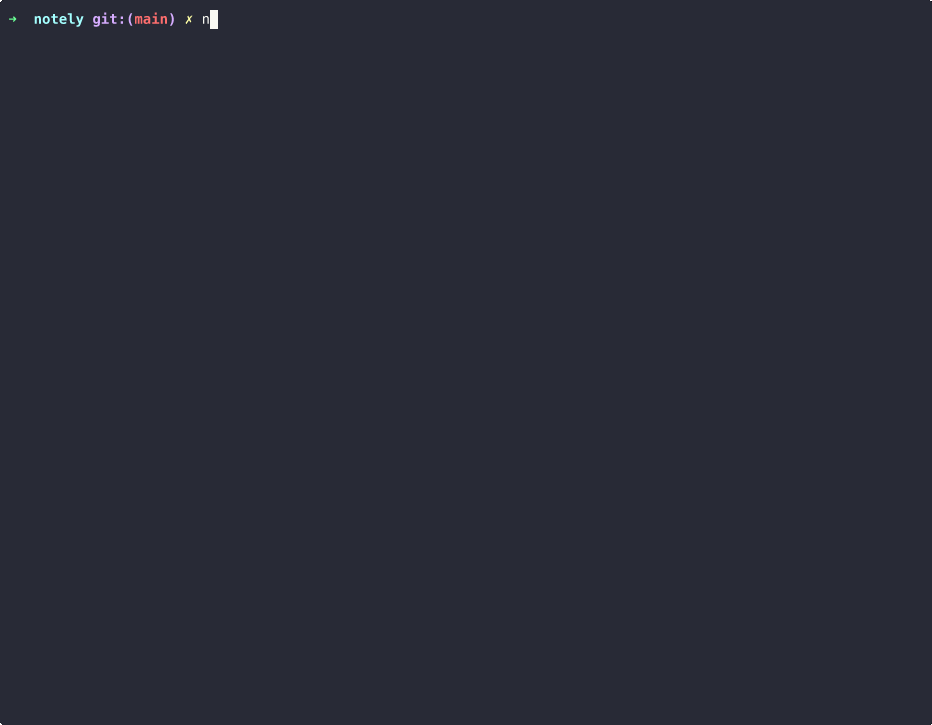
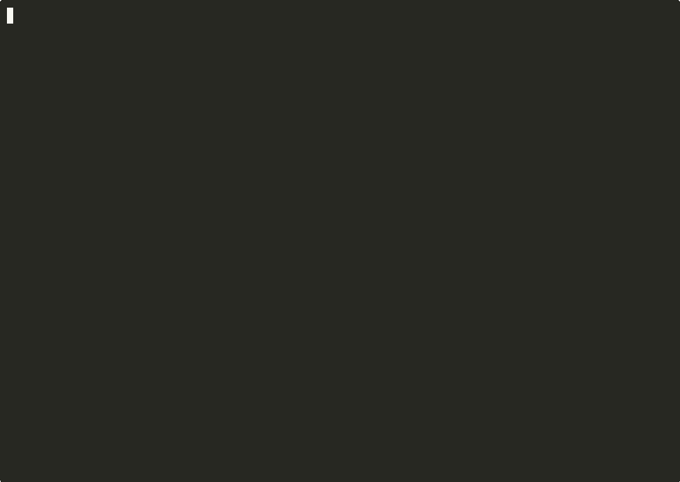
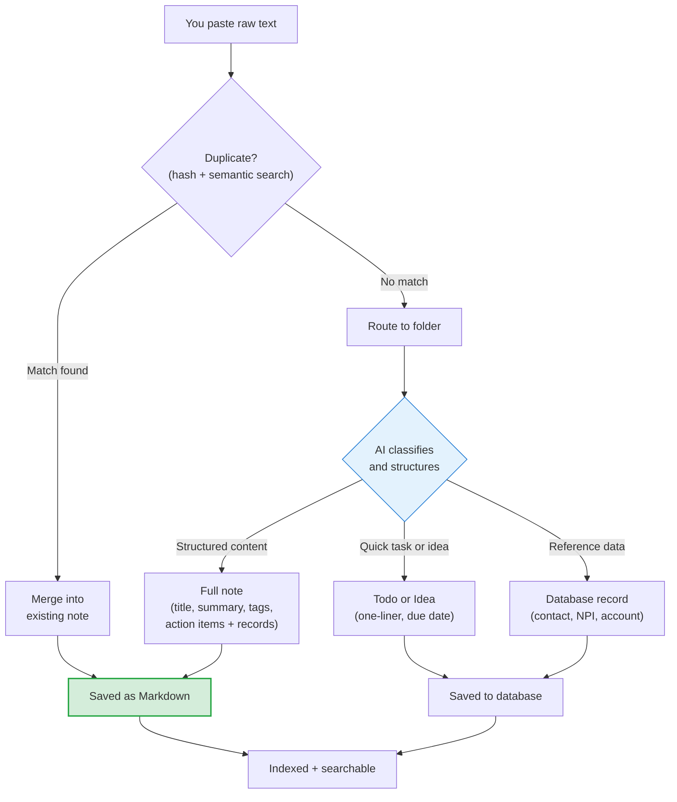
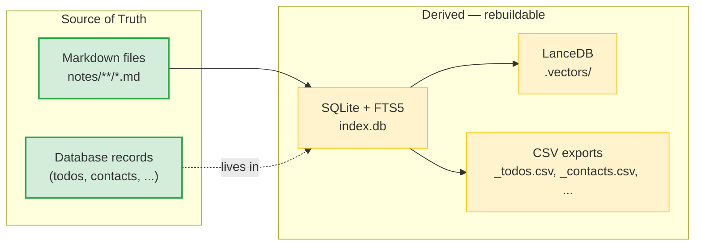

```
 ███╗   ██╗ ██████╗ ████████╗███████╗██╗  ██╗   ██╗
 ████╗  ██║██╔═══██╗╚══██╔══╝██╔════╝██║  ╚██╗ ██╔╝
 ██╔██╗ ██║██║   ██║   ██║   █████╗  ██║   ╚████╔╝
 ██║╚██╗██║██║   ██║   ██║   ██╔══╝  ██║    ╚██╔╝
 ██║ ╚████║╚██████╔╝   ██║   ███████╗███████╗██║
 ╚═╝  ╚═══╝ ╚═════╝    ╚═╝   ╚══════╝╚══════╝╚═╝
 A notes system that works for you and your AI.
```

[](https://pypi.org/project/notely/)
[](LICENSE)
[](https://www.python.org/downloads/)
[](https://github.com/chloeliu/notely/actions/workflows/test.yml)

Paste your meeting notes, Slack threads, or quick thoughts. AI organizes them into searchable markdown files. You never have to sort, tag, or file anything yourself.

```
You paste this:                          You get this:

  hey just got off the call with          notes/clients/acme/2026-03-05_acme-kickoff.md
  Jake from Acme. they want to            ---
  launch by Q3, need us to scope          title: Acme Kickoff Call
  the API integration first.              summary: Acme wants Q3 launch, API integration
  Jake will send the spec by                scoping needed first.
  Friday. budget is 50k.                  tags: [kickoff, api, acme]
                                          participants: [Jake]
                                          action_items:
                                            - task: Send API spec
                                              owner: Jake
                                              due: 2026-03-07
                                          ---
                                          Full structured notes here...
```

Notely handles the rest: duplicate detection (won't save the same paste twice), folder routing (figures out where it goes), action item extraction, and full-text + semantic search across everything.

## Quick Start

```bash
pip install notely

# Verify it installed
notely --help

# Pick any folder — this is where your notes will live
mkdir my-notes && cd my-notes

# Interactive setup — asks for your API key and designs your filing system
notely init

# Start capturing
notely open
```

Notely uses the Anthropic API (Claude) to structure your notes. `notely init` will ask for your API key if you don't have one — get it at [console.anthropic.com](https://console.anthropic.com/).

> **`notely` command not found?** Try `python -m notely --help`. If that works, your Python scripts directory isn't in your PATH. Run `pip show notely` to find where it's installed.

### What `notely init` does

`notely init` is an interactive wizard. You describe your work, and the AI creates a folder structure that fits:

```
$ notely init

  What kind of notes will you be taking?
  > I manage 3 client accounts and have personal stuff too

  Creating workspace...

  my-notes/
  ├── config.toml
  └── notes/
      ├── clients/
      │   ├── acme/
      │   └── globex/
      └── personal/
```

You can always add folders later with `/mkdir` inside `notely open`, or let the AI create new folders automatically as your notes come in.

After init, run `notely open` to start an interactive session. Paste anything — meeting notes, Slack threads, quick thoughts. The AI structures it and files it in the right folder as a clean markdown file.

## Demos

### Capture notes

Paste meeting notes, AI structures with preview, save to folder:



### Search and chat

`/search` with folder autocomplete, KWIC results, then `/chat` with AI Q&A:



### Manage todos

`/todo` folder-scoped view, AI-parsed `add` with field autocomplete, revise with AI:


## What It Looks Like

### Capturing notes

```
notely-notetaker> [paste your meeting notes, Slack thread, anything]

  Preview
  ──────────────────────────────────────
  Acme Kickoff Call
  Acme wants Q3 launch, API integration scoping needed first.
  tags: kickoff, api, acme
  participants: Jake

  Action items:
    [ ] Send API spec — Jake, due Fri
  ──────────────────────────────────────

  [Y]es, save / [e]dit / [r]evise with AI / [n]o, skip: y
  Saved: clients/acme/2026-03-05_acme-kickoff.md
```

### Managing todos

```
notely-todo (Acme)> add Schedule kickoff with Canvas Medical due=friday

  Task:   Schedule kickoff with Canvas Medical
  Owner:  Chloe
  Due:    2026-03-20
  [Y]es, save / [e]dit / [r]evise with AI / [n]o, skip: y
  Added.

notely-todo (Acme)> edit 1 2 3 due=tomorrow

  Apply to #1, #2, #3:
  due=2026-03-16
  [Y]es, apply / [n]o, cancel: y
  Updated 3 todo(s).
```

Type naturally or use `key=value` syntax — AI (Haiku) parses it. `edit` works on single items (interactive field picker) or batch (`edit 1 2 3 owner=jake`).

### Searching

```
notely-notetaker> /search acme

Search mode. Type queries, 'q' to exit.
notely-search (Acme)> API integration

  1. Acme Kickoff Call  clients/acme · 2026-03-05
     ...Acme wants Q3 launch, API integration scoping needed first...

  2. Platform Architecture  projects/vault · 2026-02-28
     ...REST API design decisions for the Vault project...

notely-search (Acme)> q
```

### Chatting with your notes

```
notely-notetaker> /chat acme

notely-chat (Acme)> what are the open items for Acme?

  Based on your notes, here are the open items:
  1. Jake needs to send the API spec (due Friday)
  2. SOW review is pending (due Monday)
  3. No timeline set for scoping yet
```

## How It Works



Duplicate detection runs first — three layers (exact hash, snippet hash, semantic search) catch re-pastes before any AI call. Then the AI classifies your input and structures it. Meeting notes become full notes with action items and database records extracted in one call. "Call dentist Friday" becomes a todo. An account number becomes a searchable database record.

**Markdown files are the source of truth.** Everything else (search index, vectors, CSV exports) is derived and can be rebuilt with `notely reindex`. You can edit your notes by hand in any text editor — notely respects your changes.

### Data Architecture



## Two Ways to Use It

### CLI (default)

Uses the Anthropic API to structure your notes. Requires an API key.

```bash
notely open          # Interactive session
notely dump < file   # One-shot: pipe text in, get structured note out
```

### MCP Server (Claude Desktop / Claude Max)

Claude becomes the AI — no API calls, no cost. Add to your Claude Desktop config:

```json
{
  "mcpServers": {
    "notely": {
      "command": "python",
      "args": ["-m", "notely.mcp_server"],
      "cwd": "/path/to/your/workspace"
    }
  }
}
```

Both paths produce the same markdown files and search index.

## Commands

| Command | What it does |
|---------|-------------|
| `notely open` | Interactive session — paste notes, drag files, slash commands |
| `notely dump` | One-shot: pipe text in, AI structures, save |
| `notely search <query>` | Full-text + semantic search across all notes |
| `notely todo` | View and manage action items |
| `notely ideas` | View and manage ideas pipeline |
| `notely list` | List recent notes |
| `notely show <id>` | Display a full note |
| `notely edit <id>` | Open in your editor, re-indexes on save |
| `notely spaces` | Show workspace overview (spaces, groups, note counts) |
| `notely query` | JSON query API for agents and scripts |
| `notely init` | Set up a new workspace |
| `notely reindex` | Rebuild search index from markdown files |

### Inside `notely open`

| Command | What it does |
|---------|-------------|
| `/todo [folder]` | Interactive todo mode — add, edit, done, batch edit (`edit 1 2 3 due=tomorrow`) |
| `/search <folder\|query>` | Interactive search mode — hybrid FTS + semantic, keyword-highlighted snippets |
| `/chat <folder>` | AI chat scoped to a folder's notes |
| `/<db_name>` | Database interactive mode — AI-parsed add, update, delete, browse records |
| `/clip <url>` | Save a web page as a note |
| `/timer <folder> <desc>` | Time tracking — start, stop, retroactive logging |
| `/folder <name>` | Set a working folder for the session |
| `/edit <id>` | Edit a note in your editor |
| `/delete <id>` | Delete a note (with confirmation) |
| `/list [folder]` | List recent notes |
| `/secret` | View stored secrets (`/secret service key` to reveal a value) |
| `/agent [folder]` | Conversational AI agent with external service access |
| `/workflow` | Create, list, and run automated YAML workflows |
| `/inbox` | Review items deposited by workflows |
| `/sync` | Re-sync all files to database |
| `/mkdir <path>` | Create a new folder |
| `/rmdir <path>` | Remove an empty folder |

## Key Features

**Smart classification** — The AI decides what your input is. Paste meeting notes and it creates a structured note with title, summary, tags, and action items. Type "call dentist Friday" and it creates a todo. Paste an account number or NPI and it stores a searchable database record. You never have to tell it which type — it figures it out.

**Databases** — Notely has a built-in lightweight database system for structured records. Todos, contacts, providers, plain facts — each is a "database" you can query, browse, and export. The AI extracts records inline when structuring notes (one call produces both the note and its todos/contacts). Type `/<name>` (e.g. `/contacts`, `/todo`) to enter interactive mode. Add records with natural language — `add Dr. Smith phone 555-1234, npi 1234567890` or use `key=value` syntax. AI (Haiku) parses free-form input into structured fields with date conversion and field mapping. Create new databases on the fly — just paste data and notely walks you through setup. Each database gets its own CSV export and full-text search.

**Duplicate detection** — Three layers: exact hash, snippet hash, and semantic search. Notely won't let you save the same meeting notes twice. If it finds a match, it offers to merge the new information in.

**Secret masking** — Wrap sensitive data in `|||secret|||` markers. The values are replaced with `[REDACTED]` before any text is sent to the AI. Secrets are stored in `.secrets.toml` — a local file, completely separate from the database system. Your secrets never leave your machine.

```
You paste:   pypi token |||pypi-AgEIcHl...|||
AI sees:     pypi token [REDACTED]
Saved to:    .secrets.toml → [pypi] api_token = "pypi-AgEIcHl..."
```

Retrieve secrets with `/secret` inside `notely open` — tab-completes service and key names, only shows values when you specify both.

**Folder routing** — AI figures out where each note belongs based on your workspace structure. At any routing prompt, you can type a folder path directly (e.g. `clients/acme`) instead of picking a number — notely resolves it or creates the folder on the spot.

**Web clipping** — `/clip <url>` saves any web page as a structured note. Requires the optional Firecrawl dependency (`pip install "notely[web]"`) and a [Firecrawl API key](https://firecrawl.dev).

**File attachments** — Drag or paste file paths. Supports text, PDF (with table extraction), and images (described via Vision API).

**Customizable AI prompts** — Override how notely classifies, structures, and merges notes by placing template files in your workspace's `templates/` directory. See [Customizing AI Prompts](docs/ARCHITECTURE.md#customizing-ai-prompts) for details.

## Workspace Structure

After running `notely init`, your workspace looks like:

```
my-workspace/
├── config.toml         # Your spaces and settings
├── notes/              # Markdown files (source of truth)
│   ├── clients/
│   │   └── acme/       # One folder per client/project
│   └── personal/
├── index.db            # Search index (auto-generated)
├── _todos.csv          # Todo list (auto-generated)
├── _contacts.csv       # Per-database CSV exports (auto-generated)
└── .env                # Your API key (gitignored)
```

**Spaces** are top-level categories (clients, projects, personal). **Groups** are folders within a space (one per client, project, etc.). Define them in `config.toml` or let `notely init` set them up interactively.

## Contributing

See [CONTRIBUTING.md](CONTRIBUTING.md) for setup, testing, and PR guidelines. See [docs/ARCHITECTURE.md](docs/ARCHITECTURE.md) for the pipeline, data model, and how to extend notely.

```bash
# Developer setup
pip install -e ".[dev]"
python -m pytest tests/ -v    # 240+ tests
```

## License

MIT. See [LICENSE](LICENSE).
