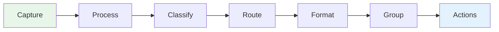
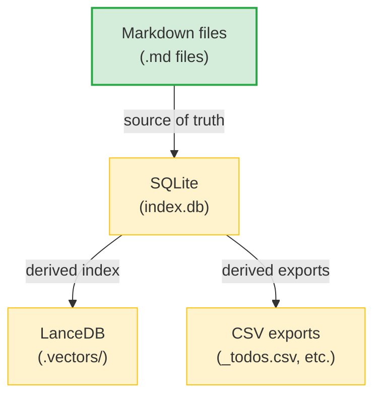
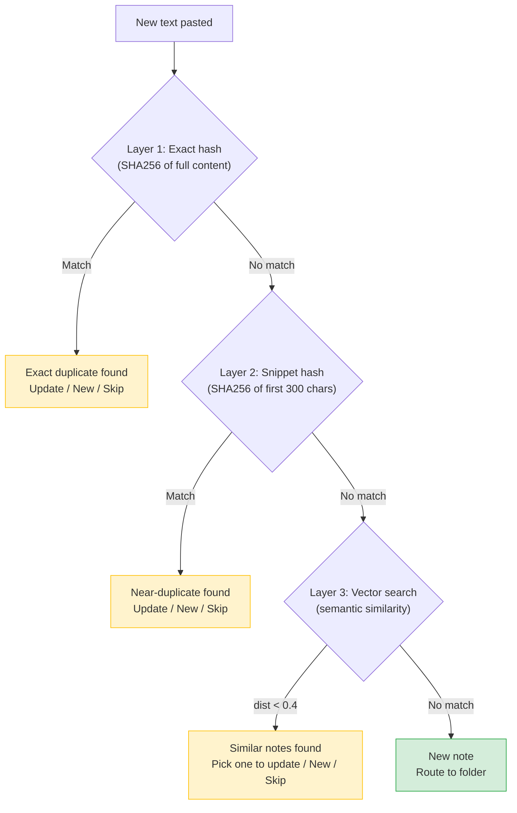

# Notely Architecture

This document explains how notely works internally and how to build on top of it. Read this if you want to add a module, customize the AI behavior, or understand the data flow.

## The Pipeline

Every piece of text that enters notely flows through a pipeline:



| Stage | What happens | Where |
|-------|-------------|-------|
| **Capture** | User pastes text, drags a file, clips a URL | `_input.py`, `_inbox.py`, `dump.py` |
| **Process** | Extract content from PDFs, images, web pages | `files.py`, `web.py`, `ai.py` (Vision) |
| **Classify** | AI decides: structured note, quick todo/idea, or snippet | `ai.py` (`_build_system_prompt`) |
| **Route** | Hash check → vector search → user confirmation → folder | `routing.py` |
| **Format** | AI structures content into title, summary, tags, body | `ai.py` (`_build_structuring_prompt`) |
| **Group** | Extract action items, todos, references from the note | `db.py`, `storage.py` |
| **Actions** | User acts on extracted items (mark done, assign, etc.) | `_todo_mode.py`, `_handlers.py` |

## Core Data Model

Notely has three core data types:

| Type | Storage | Purpose |
|------|---------|---------|
| **Notes** | Markdown files + SQLite + LanceDB vectors | Structured knowledge — meetings, Slack threads, documents |
| **Snippets** | SQLite `snippets` table with FTS5 | Reference data — NPIs, account numbers, URLs, quick facts |
| **Secrets** | `.secrets.toml` (gitignored) | Credentials — API keys, passwords, tokens. Auto-routed when `\|\|\|` markers detected |

**Todos** are built as a module on top of Notes. Action items live in note frontmatter and are indexed into the `action_items` table in SQLite. Standalone todos (not linked to a note) are also supported.

### One-Way Data Flow



Data only flows downward. If you want to change something, modify the Note object -> write markdown -> re-index to DB. Never update the DB and sync back to markdown. The `notely reindex` command rebuilds everything from markdown files.

## File Layout

```
my-workspace/
├── config.toml           # Space definitions, user_name
├── index.db              # SQLite search index (derived)
├── .env                  # API keys (gitignored)
├── .secrets.toml         # Stored credentials (gitignored)
├── .raw/                 # Original unprocessed input
├── .vectors/             # LanceDB embeddings (derived)
├── _todos.csv            # Auto-synced todo list
├── _references.csv       # Auto-synced reference data
├── _timelog.csv           # Time tracking entries
├── templates/            # User-editable AI prompt templates (optional)
│   ├── classifier.md     # How input is classified
│   ├── formatter.md      # How notes are structured
│   └── merger.md         # How content is merged
├── notes/                # Markdown files (source of truth)
│   └── <space>/<group>/[<subgroup>/]<date>_<slug>.md
└── attachments/          # File attachments (mirrors notes/ structure)
```

## Customizing AI Behavior

The AI prompts that control how notely processes your notes are fully customizable. Create a `templates/` directory in your workspace and add any of these files:

### `templates/classifier.md`

Controls how input is classified — whether it becomes a full note, a quick todo/idea, or a reference snippet.

**Available placeholders:**
- `{today}` — current date (YYYY-MM-DD)
- `{user_str}` — user name context (empty if not set)
- `{taxonomy}` — JSON of your workspace's space/group structure
- `{todays_notes_str}` — notes already created today (for append detection)
- `{size_guidance}` — guidance based on input length (short/medium/large)

### `templates/formatter.md`

Controls how raw text is structured into a note — title, summary, tags, body, action items.

**Available placeholders:**
- `{today}` — current date
- `{user_str}` — user name context
- `{space_info}` — target space configuration (JSON)
- `{size_guidance}` — input length guidance

### `templates/merger.md`

Controls how new content is merged into an existing note — what to update, what to preserve.

**Available placeholders:**
- `{today}` — current date
- `{user_str}` — user name context
- `{space_info}` — target space configuration
- `{existing_note_str}` — full existing note state (title, summary, tags, body, action items)

### How to customize

1. Run `notely open`, then look at the built-in defaults:
   ```python
   # In a Python shell:
   from notely.templates import load_template, CLASSIFIER, FORMATTER, MERGER
   print(load_template(None, FORMATTER))
   ```

2. Copy the default to your workspace:
   ```bash
   mkdir -p templates
   # Edit templates/formatter.md
   ```

3. Modify the template. Keep the `{placeholder}` variables — they're filled at runtime. Change the instructions, rules, and behavior around them.

If a template file exists in your workspace, it overrides the built-in default. If not, the built-in is used. You can override one template without affecting the others.

## Source Code Map

```
src/notely/
├── config.py          # Config loading, workspace auto-discovery
├── models.py          # Pydantic data models (Note, ActionItem, etc.)
├── db.py              # SQLite database, FTS5 search, CRUD operations
├── storage.py         # Markdown file I/O, CSV sync, merge helpers
├── ai.py              # Claude API integration, prompt building
├── templates.py       # User-editable prompt template loading
├── prompts.py         # Standardized interactive CLI prompts
├── routing.py         # Duplicate detection + folder routing pipeline
├── vectors.py         # LanceDB vector store, semantic search
├── files.py           # File detection, text extraction (PDF/image)
├── secrets.py         # Credential storage (.secrets.toml)
├── timer.py           # CSV-based time tracking
├── dedup.py           # Todo deduplication (pure functions)
├── web.py             # Web page fetching (optional, via Firecrawl)
├── dates.py           # Natural language date parsing
├── mcp_server.py      # MCP server (16 tools for Claude Desktop)
├── onboarding.py      # Interactive `notely init` wizard
├── cli.py             # Click CLI entry point
│
└── commands/
    ├── open_cmd/      # `notely open` — main interactive session
    │   ├── _session.py     # Main loop, command dispatch
    │   ├── _shared.py      # Shared utilities (console, folder helpers)
    │   ├── _completers.py  # Tab completion (slash commands, folders, notes)
    │   ├── _input.py       # Note capture pipeline (paste → AI → save)
    │   ├── _handlers.py    # Slash command handlers (/todo, /timer, etc.)
    │   ├── _todo_mode.py   # Interactive todo sub-mode
    │   ├── _inbox.py       # Inbox review flow
    │   └── _agent.py       # Agent/chat modes
    ├── dump.py        # One-shot note processing
    ├── todo.py        # CLI todo management
    ├── search_cmd.py  # Full-text search
    ├── list_cmd.py    # List recent notes
    └── ...
```

## Key Patterns

### Adding a slash command

1. Add the handler function in `commands/open_cmd/_handlers.py`
2. Add the dispatch case in `commands/open_cmd/_session.py`
3. Add tab completion in `commands/open_cmd/_completers.py`

### Adding a sub-mode (like `/todo`)

Sub-modes are interactive loops with their own prompt, commands, and completers. See `_todo_mode.py` as the reference implementation:

1. Create `commands/open_cmd/_yourmode.py`
2. Define an entry function: `def _your_mode(config: NotelyConfig) -> None`
3. Use `prompt_toolkit.PromptSession` for input with custom completers
4. Dispatch commands in a `while True` loop
5. Call from a slash command handler in `_handlers.py`

The pattern:
```python
def _your_mode(config: NotelyConfig) -> None:
    session = PromptSession(completer=YourCompleter())
    while True:
        try:
            text = session.prompt("\nnotely-yourmode> ")
        except (EOFError, KeyboardInterrupt):
            break
        cmd = text.strip().lower()
        if cmd in ("q", "/back"):
            break
        elif cmd == "your_command":
            _handle_your_command(config)
```

### Database access pattern

```python
from ..db import Database

with Database(config.db_path) as db:
    db.initialize()
    items = db.get_open_action_items()
    # ... work with items
# db.close() called automatically
```

### Folder resolution

Folders are identified by `file_path` patterns, not metadata fields:

```python
# Correct: use file_path LIKE
db.search(query, filters=SearchFilters(space="clients", folder="sanity"))
# This generates: WHERE file_path LIKE 'clients/sanity/%'

# Wrong: don't use space_metadata
# json_extract(space_metadata, '$.project') — often empty
```

### Routing folder input

At any routing prompt (numbered choices), users can also type a folder path directly instead of picking a number:

- **Existing folder** — matches by full path (`clients/acme`), slug (`acme`), or display name (`Acme Corp`)
- **New folder** — `clients/newproject` creates the folder immediately (mkdir + DB + vectors), so it persists even if the user cancels the note

The `_resolve_folder_text()` function in `routing.py` handles this resolution. It's used by both the inline typing at routing prompts and the dedicated `_prompt_folder_with_autocomplete()` prompt (which adds tab completion).

### Folder autocomplete

The routing autocomplete (`_FolderCompleter` in `routing.py`) uses hierarchical drill-down:

- **Empty tab** → shows all config spaces (not just spaces with existing folders)
- **`clients/` + tab** → shows existing groups under that space
- **`pro` + tab** → fuzzy-matches both space names and existing folder paths

New folders are created eagerly (on the filesystem + in DB) at routing time, not deferred to save time. Empty folders from cancelled notes are fine — they show up in autocomplete for next time and can be cleaned up with `/rmdir`.

### Shared folder utilities

```python
from ._shared import _get_all_folders, _fuzzy_match_folder

# Get all folders for autocomplete
folders = _get_all_folders(config)  # list of (space, group_slug, display_name)

# Fuzzy match user input to a folder
match = _fuzzy_match_folder(config, "sanity")  # → ("clients", "sanity", "Sanity Health")
```

## Duplicate Detection

Three layers, checked in order:



Hash checks use paste content only (not typed context), so "meeting notes [paste]" and "[paste]" both match the same hash.

## Secret Handling

When text is wrapped in `|||` markers, notely treats it as sensitive:

1. `mask_secrets()` scans the **full input** (including typed context around pastes) for `|||value|||` patterns
2. Values are replaced with `[REDACTED_N]` before the AI sees anything
3. If the AI classifies the input as reference data (snippet), the values are routed to `.secrets.toml` with the AI's entity/key naming — **not** saved as visible snippets in the database
4. A confirmation prompt shows masked values before saving
5. Retrieve with `/secret` — tab-completes service names and keys

```
Input:    pypi token |||pypi-AgEIcHl...|||
AI sees:  pypi token [REDACTED_1]
Stored:   .secrets.toml → [pypi] api_token = "pypi-AgEIcHl..."
```

Key design: `mask_secrets()` runs on the full `raw_text` (which contains the `|||` markers from typed context), then replaces the real values in whichever text portion is sent to the AI. This handles the case where `|||` markers are typed around a paste — the paste content alone wouldn't contain the markers.

## Embedding Design

| Table | Row per | Embedding text | Purpose |
|-------|---------|---------------|---------|
| `directories` | folder | `"Display Name -- sampled note summaries"` | Route to folders |
| `note_summaries` | note | `"title. summary. raw_snippet"` | Find similar notes |

Uses `fastembed` with `BAAI/bge-small-en-v1.5` (384 dims, ~33MB ONNX). Runs locally — no API key needed.

## MCP Server

16 tools for Claude Desktop integration. Key tools:

| Tool | Purpose |
|------|---------|
| `find_similar` | Duplicate detection before saving |
| `save_note` / `update_note` | Create/update notes |
| `search_notes` | Full-text search |
| `get_context` | Folder overview with recent notes + open todos |
| `add_todo` / `complete_todo` | Todo management |
| `store_reference` / `get_references` | Reference data |

Claude only calls write tools when the user explicitly asks ("save this", "note this down"). Read tools are safe for proactive use.

## Testing

```bash
# Install dev dependencies
pip install -e ".[dev]"

# Run tests
python -m pytest tests/ -v
```

140 tests covering: database operations, config loading, vector escaping, timer logic, todo dedup, todo mode, interactive prompts, date parsing.

### CI/CD

- **`.github/workflows/test.yml`** — runs pytest on Python 3.10–3.13 on every push/PR to main
- **`.github/workflows/publish.yml`** — builds and publishes to PyPI on `v*` tag push using [PyPI Trusted Publishing](https://docs.pypi.org/trusted-publishers/)

Release workflow: bump version in `pyproject.toml` → commit → `git tag v0.x.x && git push origin v0.x.x` → auto-publishes.

## Dependencies

Core: `click`, `rich`, `anthropic`, `pydantic`, `python-frontmatter`, `python-slugify`, `mcp[cli]`, `prompt-toolkit`, `lancedb`, `fastembed`

Optional:
- `pip install "notely[pdf]"` — PDF extraction (pymupdf4llm)
- `pip install "notely[web]"` — Web clipping (firecrawl-py)
