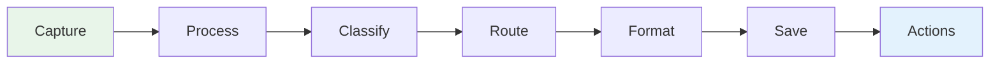
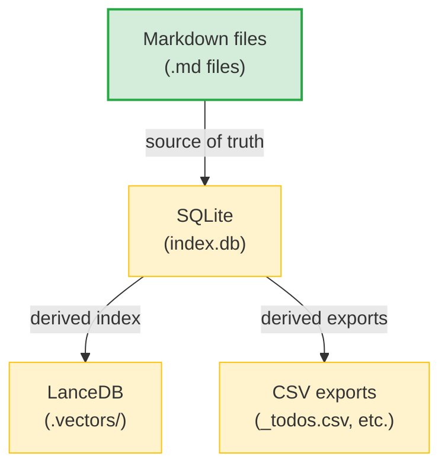
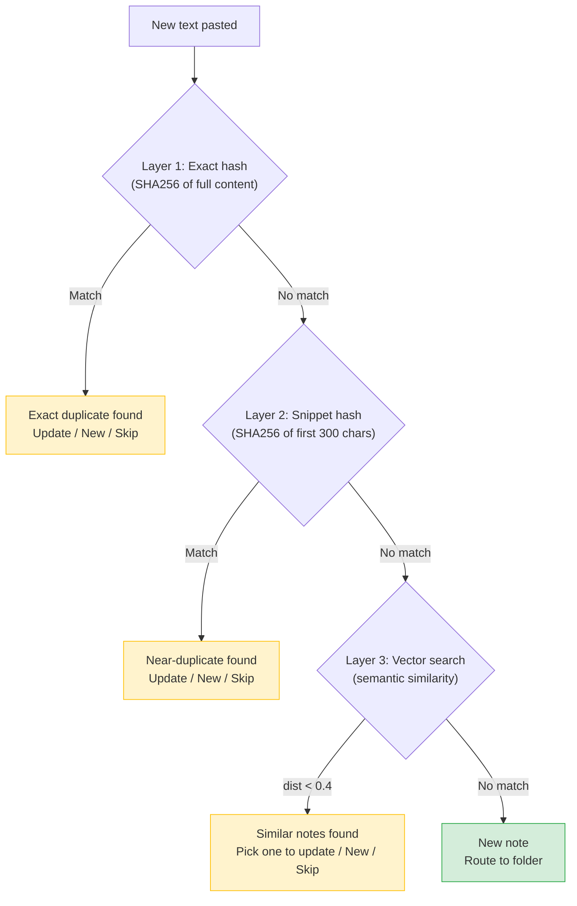

# Notely Architecture

This document explains how notely works internally and how to build on top of it. Read this if you want to add a module, customize the AI behavior, or understand the data flow.

## The Pipeline

Every piece of text that enters notely flows through a pipeline:



| Stage | What happens | Where |
|-------|-------------|-------|
| **Capture** | User pastes text, drags a file, clips a URL | `_input.py`, `_inbox.py`, `dump.py` |
| **Process** | Extract content from PDFs, images, web pages | `files.py`, `web.py`, `ai.py` (Vision) |
| **Classify** | AI decides: structured note, quick todo/idea, or database record | `ai.py` (`_build_system_prompt`) |
| **Route** | Hash check → vector search → user confirmation → folder | `routing.py` |
| **Format** | AI structures content into title, summary, tags, body, and extracts records (todos, contacts, etc.) inline via `extracted_records` | `ai.py` (`_build_structuring_prompt`) |
| **Save** | Write markdown, save extracted records to databases, sync all stores | `storage.py` (`save_and_sync`) |
| **Actions** | User acts on extracted items (mark done, assign, etc.) | `_todo_mode.py`, `_database_mode.py`, `_handlers.py` |

## Core Data Model

Notely has three core data types, each with its own storage:

| Type | Storage | Purpose |
|------|---------|---------|
| **Notes** | Markdown files + SQLite index + LanceDB vectors | Structured knowledge — meetings, Slack threads, documents |
| **Databases** | SQLite `snippets` table with FTS5 | Structured records — todos, contacts, providers, plain facts, and any user-defined type |
| **Secrets** | `.secrets.toml` (local file, gitignored) | Sensitive credentials — API keys, passwords, tokens |

**Notes** are the primary data type. Markdown files are the source of truth, and the SQLite index is derived (rebuildable via `notely reindex`).

**Databases** are notely's lightweight structured data system. All databases share one SQLite table (`snippets`), with a `snippet_type` column as the discriminator — each unique value is a separate "database." Todos, contacts, and plain facts are all databases. They're not part of the note markdown files — they live purely in the SQLite index.

**Secrets** are completely separate from both notes and databases. They're stored in `.secrets.toml` (a local TOML file), never in the database. When text contains `|||secret|||` markers, the values are masked before the AI sees them and saved to `.secrets.toml`. See [Secret Handling](#secret-handling) for details.

### The database system

Every database in notely is a filtered view over the `snippets` table. The `snippet_type` column determines which "database" a record belongs to:

| `snippet_type` | Kind | What it stores |
|----------------|------|---------------|
| `"todo"` | **Built-in** | Action items with owner and optional due date. Extracted automatically from notes |
| `"fact"` | **Built-in** | Plain text facts and decisions. The default catch-all database |
| `"contacts"` | **User-created** | Structured entity→key→value records (e.g. Dr. Smith → phone → 555-1234) |
| `"providers"` | **User-created** | Structured entity→key→value records (e.g. Acme Lab → NPI → 1234567890) |
| *any name* | **User-created** | You can create databases for anything — accounts, references, bookmarks, etc. |

Every database works the same way: accessible via `/<name>` in `notely open`, gets its own CSV export (`_<name>.csv`), supports full-text search, and has an interactive mode for CRUD operations.

**Todos are a built-in database**, not a separate system. They happen to have special handling — frontmatter sync with notes, status management (`open`/`done`), owner attribution, and the `/todo` interactive mode — but under the hood they're stored in the same `snippets` table as everything else.

### Creating databases

Databases are created on first use, not pre-defined. There are two entry points:

**Via AI classification** — you paste data (a contact card, account info, etc.) and the AI classifies it as a database record. If the AI suggests a type that doesn't exist yet, you're prompted:

```
AI suggests snippet_type = "providers"
    → No "providers" database found
    → [1] contacts (existing databases shown)
      [c] Create "providers" database
      [f] Flat fact (save to the default "fact" database)
      [s] Skip
```

If you choose to create, the flow is:
1. **Name** — confirm or change the AI's suggestion
2. **Description** — what is this database for? (optional)
3. **Fields** — expected field names, comma-separated (optional, e.g. `phone, npi, fax, address`)
4. **Auto-extract** — should the AI extract records of this type from future notes? `[y/n]`

**Via slash command** — type `/<name> add entity key value` for a database that doesn't exist yet, and notely walks you through creation.

Database metadata (description, fields, auto-extract flag) is stored as `_meta` entity rows in the `snippets` table itself — no separate metadata table.

### Inline record extraction

When the AI structures a note, it can also extract database records in the same call via the `extracted_records` field. One AI call produces both a structured note AND its associated records — no separate extraction step.

Which databases get extracted? Any database with `extract_from_notes` enabled in its metadata. The built-in `"todo"` database always has this enabled. User-created databases can opt in during creation.

```
User pastes meeting notes
    → AI structures the note (title, summary, tags, body)
    → AI also extracts records:
        - todo: "Deploy v2" (owner: Jake, due: 2026-03-15)
        - contacts: Jake → email → jake@acme.com
    → User confirms the note preview
    → Note saved to markdown, records auto-saved to databases
```

For todos specifically, extracted records are parsed into `ActionItem` objects for backward compatibility with frontmatter and the `/todo` display.

### One-Way Data Flow



Data only flows downward. If you want to change something, modify the Note object -> write markdown -> re-index to DB. Never update the DB and sync back to markdown. The `notely reindex` command rebuilds everything from markdown files.

## File Layout

```
my-workspace/
├── config.toml           # Space definitions, user_name
├── index.db              # SQLite search index (derived)
├── .env                  # API keys (gitignored)
├── .secrets.toml         # Stored credentials (gitignored)
├── .raw/                 # Original unprocessed input
├── .vectors/             # LanceDB embeddings (derived)
├── _todos.csv            # Auto-synced todo list
├── _<db_name>.csv        # Per-database CSV exports (auto-synced)
├── _timelog.csv           # Time tracking entries
├── templates/            # User-editable AI prompt templates (optional)
│   ├── classifier.md     # How input is classified
│   ├── formatter.md      # How notes are structured
│   └── merger.md         # How content is merged
├── notes/                # Markdown files (source of truth)
│   └── <space>/<group>/[<subgroup>/]<date>_<slug>.md
└── attachments/          # File attachments (mirrors notes/ structure)
```

## Customizing AI Behavior

The AI prompts that control how notely processes your notes are fully customizable. Create a `templates/` directory in your workspace and add any of these files:

### `templates/classifier.md`

Controls how input is classified — whether it becomes a full note, a quick todo/idea, or a database record.

**Available placeholders:**
- `{today}` — current date (YYYY-MM-DD)
- `{user_str}` — user name context (empty if not set)
- `{taxonomy}` — JSON of your workspace's space/group structure
- `{todays_notes_str}` — notes already created today (for append detection)
- `{size_guidance}` — guidance based on input length (short/medium/large)
- `{databases_str}` — database catalog (names, descriptions, fields for auto-extract databases)

### `templates/formatter.md`

Controls how raw text is structured into a note — title, summary, tags, body, and inline record extraction (todos, contacts, etc. via `extracted_records`).

**Available placeholders:**
- `{today}` — current date
- `{user_str}` — user name context
- `{space_info}` — target space configuration (JSON)
- `{size_guidance}` — input length guidance
- `{databases_str}` — database catalog for record extraction

### `templates/merger.md`

Controls how new content is merged into an existing note — what to update, what to preserve, and what new records to extract.

**Available placeholders:**
- `{today}` — current date
- `{user_str}` — user name context
- `{space_info}` — target space configuration
- `{existing_note_str}` — full existing note state (title, summary, tags, body, action items)

### How to customize

1. Run `notely open`, then look at the built-in defaults:
   ```python
   # In a Python shell:
   from notely.templates import load_template, CLASSIFIER, FORMATTER, MERGER
   print(load_template(None, FORMATTER))
   ```

2. Copy the default to your workspace:
   ```bash
   mkdir -p templates
   # Edit templates/formatter.md
   ```

3. Modify the template. Keep the `{placeholder}` variables — they're filled at runtime. Change the instructions, rules, and behavior around them.

If a template file exists in your workspace, it overrides the built-in default. If not, the built-in is used. You can override one template without affecting the others.

## Source Code Map

```
src/notely/
├── config.py          # Config loading, workspace auto-discovery
├── models.py          # Pydantic data models (Note, ActionItem, etc.)
├── db.py              # SQLite database, FTS5 search, CRUD operations
├── storage.py         # Markdown file I/O, CSV sync, merge helpers
├── ai.py              # Claude API integration, prompt building
├── templates.py       # User-editable prompt template loading
├── prompts.py         # Standardized interactive CLI prompts
├── routing.py         # Duplicate detection + folder routing pipeline
├── vectors.py         # LanceDB vector store, semantic search
├── files.py           # File detection, text extraction (PDF/image)
├── secrets.py         # Credential storage (.secrets.toml)
├── timer.py           # CSV-based time tracking
├── dedup.py           # Todo deduplication (pure functions)
├── web.py             # Web page fetching (optional, via Firecrawl)
├── dates.py           # Natural language date parsing
├── mcp_server.py      # MCP server (16 tools for Claude Desktop)
├── onboarding.py      # Interactive `notely init` wizard
├── cli.py             # Click CLI entry point
│
└── commands/
    ├── open_cmd/      # `notely open` — main interactive session
    │   ├── _session.py     # Main loop, command dispatch
    │   ├── _shared.py      # Shared utilities (console, folder helpers)
    │   ├── _completers.py  # Tab completion (slash commands, folders, notes)
    │   ├── _input.py       # Note capture pipeline (paste → AI → save)
    │   ├── _handlers.py    # Slash command handlers (/todo, /timer, etc.)
    │   ├── _todo_mode.py   # Interactive todo sub-mode
    │   ├── _database_mode.py # Interactive database sub-mode
    │   ├── _inbox.py       # Inbox review flow
    │   └── _agent.py       # Agent/chat modes
    ├── dump.py        # One-shot note processing
    ├── todo.py        # CLI todo management
    ├── search_cmd.py  # Full-text search
    ├── list_cmd.py    # List recent notes
    └── ...
```

## Key Patterns

### Adding a slash command

1. Add the handler function in `commands/open_cmd/_handlers.py`
2. Add the dispatch case in `commands/open_cmd/_session.py`
3. Add tab completion in `commands/open_cmd/_completers.py`

### Adding a sub-mode (like `/todo`)

Sub-modes are interactive loops with their own prompt, commands, and completers. See `_todo_mode.py` as the reference implementation:

1. Create `commands/open_cmd/_yourmode.py`
2. Define an entry function: `def _your_mode(config: NotelyConfig) -> None`
3. Use `prompt_toolkit.PromptSession` for input with custom completers
4. Dispatch commands in a `while True` loop
5. Call from a slash command handler in `_handlers.py`

The pattern:
```python
def _your_mode(config: NotelyConfig) -> None:
    session = PromptSession(completer=YourCompleter())
    while True:
        try:
            text = session.prompt("\nnotely-yourmode> ")
        except (EOFError, KeyboardInterrupt):
            break
        cmd = text.strip().lower()
        if cmd in ("q", "/back"):
            break
        elif cmd == "your_command":
            _handle_your_command(config)
```

### Database access pattern

```python
from ..db import Database

with Database(config.db_path) as db:
    db.initialize()
    items = db.get_open_action_items()
    # ... work with items
# db.close() called automatically
```

### Folder resolution

Folders are identified by `file_path` patterns, not metadata fields:

```python
# Correct: use file_path LIKE
db.search(query, filters=SearchFilters(space="clients", folder="sanity"))
# This generates: WHERE file_path LIKE 'clients/sanity/%'

# Wrong: don't use space_metadata
# json_extract(space_metadata, '$.project') — often empty
```

### Routing folder input

At any routing prompt (numbered choices), users can also type a folder path directly instead of picking a number:

- **Existing folder** — matches by full path (`clients/acme`), slug (`acme`), or display name (`Acme Corp`)
- **New folder** — `clients/newproject` creates the folder immediately (mkdir + DB + vectors), so it persists even if the user cancels the note

The `_resolve_folder_text()` function in `routing.py` handles this resolution. It's used by both the inline typing at routing prompts and the dedicated `_prompt_folder_with_autocomplete()` prompt (which adds tab completion).

### Folder autocomplete

The routing autocomplete (`_FolderCompleter` in `routing.py`) uses hierarchical drill-down:

- **Empty tab** → shows all config spaces (not just spaces with existing folders)
- **`clients/` + tab** → shows existing groups under that space
- **`pro` + tab** → fuzzy-matches both space names and existing folder paths

New folders are created eagerly (on the filesystem + in DB) at routing time, not deferred to save time. Empty folders from cancelled notes are fine — they show up in autocomplete for next time and can be cleaned up with `/rmdir`.

### Shared folder utilities

```python
from ._shared import _get_all_folders, _fuzzy_match_folder

# Get all folders for autocomplete
folders = _get_all_folders(config)  # list of (space, group_slug, display_name)

# Fuzzy match user input to a folder
match = _fuzzy_match_folder(config, "sanity")  # → ("clients", "sanity", "Sanity Health")
```

## Duplicate Detection

Three layers, checked in order:



Hash checks use paste content only (not typed context), so "meeting notes [paste]" and "[paste]" both match the same hash.

## Databases — Deep Dive

Databases are notely's system for structured records that don't belong in notes. They live purely in the SQLite index (the `snippets` table), not in markdown files. See [Core Data Model](#the-database-system) for the overview.

### How records get into databases

Records enter databases through two paths:

**Path 1: Inline extraction during note structuring.** The AI extracts records alongside note structuring — see [Inline record extraction](#inline-record-extraction) above. This is how most todos and auto-extract database records are created.

**Path 2: Direct classification.** When the AI classifies input as pure reference data (not a note), it routes to the database flow directly:

```
AI classifies input as database record
    → suggests type = "providers"
    │
    ├─ "providers" database exists?
    │   YES → route to existing database
    │   NO  → prompt user (see "Creating databases" above)
    │
    ├─ Record dedup (two layers):
    │   Layer 1 — Entity name fuzzy match (SequenceMatcher):
    │     "Dr Smith" vs "Dr. Smith" → [1] Dr. Smith / [k]eep "Dr Smith"
    │   Layer 2 — Entity+key exact match (case-insensitive SQL):
    │     Same entity+key already exists → [u]pdate / [s]kip
    │
    └─ Sync CSV: write _providers.csv
```

The AI sees your existing database names, descriptions, and field names in its system prompt (via `{databases_str}` placeholder), so it prefers routing to databases that already exist. It only suggests new types when the data genuinely doesn't fit.

### Flexible schema

Database columns (keys) are not rigid. Users can define expected fields when creating a database (e.g. `phone, npi, fax, address`), but the AI can add new fields when the data calls for it. The AI sees the database description and existing field names in its system prompt and uses them to decide where to put values:

- **Existing field match** — AI reuses the field name (e.g. if `phone` exists, uses `phone` not `phone_number`)
- **New field** — AI adds a new key when the data is genuinely different from existing fields (e.g. `email` when only `phone` and `fax` existed)

This means databases grow organically. You start with a few fields, and as you paste more data, the AI adds columns as needed. Users can also update the expected fields list at any time via the `fields` command in interactive mode.

### Record deduplication

When saving records, two layers of dedup run (all code, no AI):

1. **Entity name fuzzy matching** — `find_similar_entities()` uses `SequenceMatcher` (threshold 0.7, boosted to 0.85 if one name contains the other) to catch near-duplicates. If "Dr Smith" is being saved and "Dr. Smith" already exists, the user picks the existing entity or keeps the new name. Results are cached per save batch so the same entity isn't prompted twice.

2. **Entity+key exact matching** — `find_existing_snippet()` does a case-insensitive SQL lookup on `entity + key + snippet_type`. If a record already exists with the same combination, shows both values side-by-side and prompts `[u]pdate / [s]kip`. Updates modify the value in place (same row ID via `update_snippet()`).

### Accessing databases

All database names are routed dynamically — type `/<name>` and if it matches a known database (has records), you enter interactive mode. If no database exists with that name, notely asks if you want to create one.

**Interactive mode** (`/<name>` with no args) is the primary way to manage database records — add, update, delete, and browse:

```
notely-notetaker> /contacts

notely-contacts> show Dr. Smith
  phone: 555-1234
  npi: 1234567890
  fax: 555-5678

notely-contacts> add Dr. Smith email smith@clinic.com
  Saved.

notely-contacts> delete 3
  Deleted: Dr. Smith / fax

notely-contacts> q
```

Commands inside interactive mode:
- `add ENTITY key value` — add a new record
- `show ENTITY` — show all records for an entity (contacts database also shows recent notes mentioning that person)
- `edit N` — edit a record's fields interactively (pick field, type new value, loop until done)
- `delete N [N2 N3...]` — remove records by displayed number. Supports multiple (`delete 1 3 5`), ranges (`delete 1-5`), and entity names (`delete Dr. Smith`)
- `search QUERY` — FTS search within this database
- `info` — show database settings (description, fields, auto-extract flag, record count)
- `describe` — set/update the database description
- `fields` — set/update expected field names
- `all` — show all records (including other folders)
- `open` — open the per-database CSV file in your default app
- `drop` — delete the entire database (with confirmation)
- `refresh` — reload and re-display

Tab completion is progressive: first word completes commands, second word completes entity names, third word completes key names from that database.

Interactive mode is **folder-scoped by default** — shows records matching the working folder plus global records. Use `all` to see everything.

**Quick one-liners** from the main prompt (without entering interactive mode):
- `/<name> add ENTITY key value`
- `/<name> show ENTITY`
- `/<name> delete ID`

### MCP access

`store_record()` and `get_records()` provide programmatic access via Claude Desktop. Unlike the CLI, `store_record()` auto-creates databases on first insert (no confirmation flow needed since Claude is the AI). Old `store_reference()` / `get_references()` still work as deprecated aliases.

## Secret Handling

Secrets are **completely separate from the database system**. They're stored in `.secrets.toml` (a local TOML file, gitignored), never in the SQLite index.

When text is wrapped in `|||` markers, notely treats it as sensitive:

1. `mask_secrets()` scans the **full input** (including typed context around pastes) for `|||value|||` patterns
2. Values are replaced with `[REDACTED_N]` before the AI sees anything
3. If the AI classifies the input as credential data, the values are routed to `.secrets.toml` with the AI's entity/key naming — **not** saved to any database
4. A confirmation prompt shows masked values before saving
5. Retrieve with `/secret` — tab-completes service names and keys

```
Input:    pypi token |||pypi-AgEIcHl...|||
AI sees:  pypi token [REDACTED_1]
Stored:   .secrets.toml → [pypi] api_token = "pypi-AgEIcHl..."
```

Key design: `mask_secrets()` runs on the full `raw_text` (which contains the `|||` markers from typed context), then replaces the real values in whichever text portion is sent to the AI. This handles the case where `|||` markers are typed around a paste — the paste content alone wouldn't contain the markers.

## Embedding Design

| Table | Row per | Embedding text | Purpose |
|-------|---------|---------------|---------|
| `directories` | folder | `"Display Name -- sampled note summaries"` | Route to folders |
| `note_summaries` | note | `"title. summary. raw_snippet"` | Find similar notes |

Uses `fastembed` with `BAAI/bge-small-en-v1.5` (384 dims, ~33MB ONNX). Runs locally — no API key needed.

## MCP Server

16 tools for Claude Desktop integration. Key tools:

| Tool | Purpose |
|------|---------|
| `find_similar` | Duplicate detection before saving |
| `save_note` / `update_note` | Create/update notes |
| `search_notes` | Full-text search |
| `get_context` | Folder overview with recent notes + open todos |
| `add_todo` / `complete_todo` | Todo management |
| `store_record` / `get_records` | Database records (contacts, providers, etc.) |

Claude only calls write tools when the user explicitly asks ("save this", "note this down"). Read tools are safe for proactive use.

## Testing

```bash
# Install dev dependencies
pip install -e ".[dev]"

# Run tests
python -m pytest tests/ -v
```

170+ tests covering: database operations, config loading, vector escaping, timer logic, todo dedup, todo mode, interactive prompts, date parsing.

### CI/CD

- **`.github/workflows/test.yml`** — runs pytest on Python 3.10–3.13 on every push/PR to main
- **`.github/workflows/publish.yml`** — builds and publishes to PyPI on `v*` tag push using [PyPI Trusted Publishing](https://docs.pypi.org/trusted-publishers/)

Release workflow: bump version in `pyproject.toml` → commit → `git tag v0.x.x && git push origin v0.x.x` → auto-publishes.

## Dependencies

Core: `click`, `rich`, `anthropic`, `pydantic`, `python-frontmatter`, `python-slugify`, `mcp[cli]`, `prompt-toolkit`, `lancedb`, `fastembed`

Optional:
- `pip install "notely[pdf]"` — PDF extraction (pymupdf4llm)
- `pip install "notely[web]"` — Web clipping (firecrawl-py)
